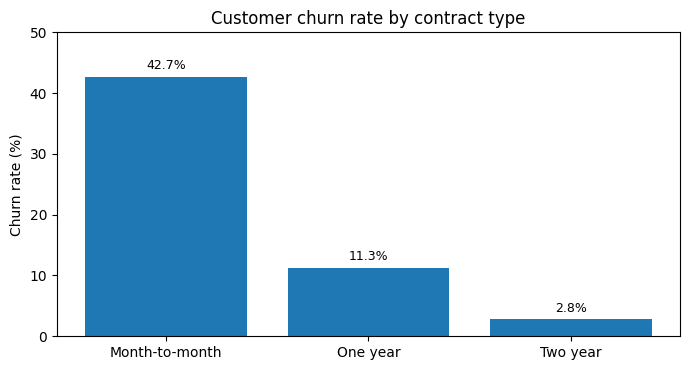
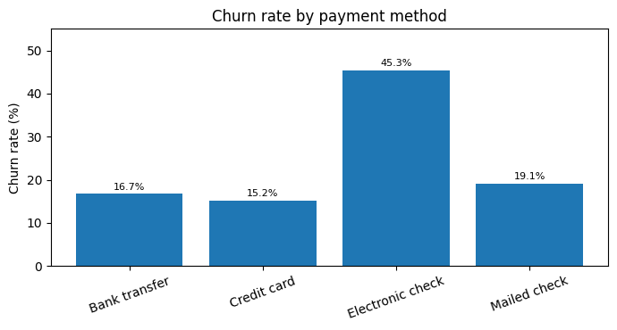
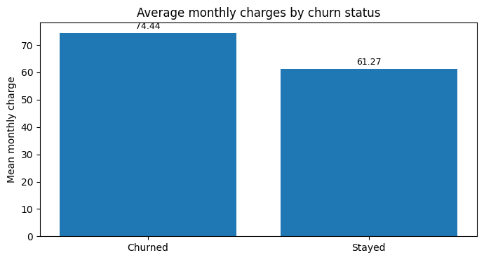
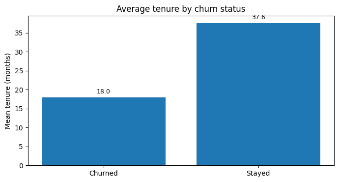

# Customer Churn & Retention Analysis

A customer analytics project examining patterns associated with churn in the **IBM Telco Customer Churn dataset**.

## Project overview

The analysis focuses on contract type, payment method, customer tenure and monthly charges to identify high-risk customer segments and translate the findings into practical retention recommendations.

**Sample:** 7,043 customer records  
**Language:** Python / R  
**Outcome:** Customer churn

## Methods

- Data cleaning and preparation
- Churn-rate segmentation
- Descriptive comparisons
- Welch independent-samples t-tests
- Chi-square test of independence
- Visualisation
- Business interpretation and retention recommendations

## Key findings

- Overall churn rate: **26.54%** (1,869 of 7,043 customers).
- Month-to-month customers had the highest observed churn rate at **42.7%**, compared with **11.3%** for one-year contracts and **2.8%** for two-year contracts.
- The relationship between contract type and churn was statistically significant (**χ² = 1184.60, p < 0.001**).
- Electronic-check customers had the highest observed churn rate at approximately **45.3%**.
- Churned customers had substantially shorter average tenure: **17.98 months** versus **37.57 months** for retained customers.
- Mean monthly charges were higher among churned customers (**$74.44**) than retained customers (**$61.27**).

## Business recommendations

1. Prioritise short-tenure, month-to-month customers for proactive retention activity.
2. Investigate electronic-check customers as a high-churn segment.
3. Test incentives that encourage longer contracts while monitoring discount cost and customer lifetime value.
4. Combine contract, tenure and charge information for customer-risk segmentation rather than relying on a single variable.
5. Extend the analysis with a multivariable churn-prediction model such as logistic regression.

## Visualisations

## Limitations

The dataset is observational, so the reported relationships should not be interpreted as causal. Contract type, payment method, tenure and monthly charges can also be correlated with other customer characteristics. A multivariable model would provide a stronger basis for estimating independent effects.

## Reproducibility

See [`analysis.R`](analysis.R) for the R analysis workflow. The repository also contains the supporting visualisations and [`project_report.pdf`](project_report.pdf).
