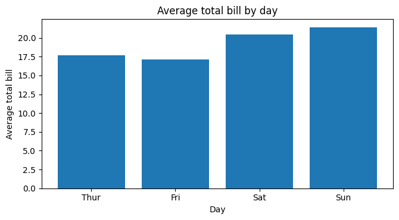
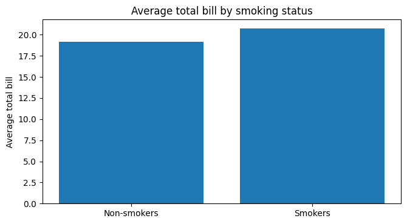

# Restaurant Spending Analysis

A quantitative customer-analytics project using the **Plotly Express tips dataset** to investigate restaurant spending patterns.

## Project overview

The project examines total bill value across days, smoking status and meal period, and evaluates the relationship between party size and total bill.

**Sample:** 244 restaurant bills  
**Language:** Python  
**Dataset:** Plotly Express `tips` dataset

## Methods

- Data preparation and feature creation
- Descriptive statistics
- Welch independent-samples t-test
- Chi-square test of independence
- Simple OLS linear regression
- Residual diagnostics
- HC3 robust standard errors

## Analytical questions

- How does average bill size vary by day?
- Do smokers and non-smokers differ in total bill value?
- Is day associated with low, medium and high bill categories?
- Is party size associated with total bill value?
- Are the regression assumptions sufficiently reasonable for interpretation?

## Business interpretation

Party size is a practical operational variable because larger groups can affect table allocation, staffing and expected spend. Differences in spending across visit characteristics can help a restaurant understand customer behaviour and demand patterns.

The results are interpreted as **associations rather than causal effects**.

## Visualisations

## Reproducibility

See [`analysis.py`](analysis.py) for the main Python workflow. The repository contains the `tips.csv` dataset, supporting visualisations and [`project_report.pdf`](project_report.pdf).

An R companion analysis is also provided in [`analysis.R`](analysis.R).
